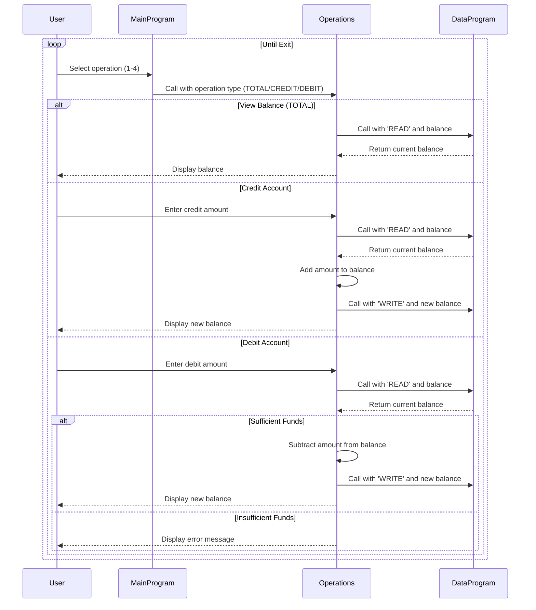

# COBOL Account Management System Documentation

## Overview
This COBOL-based system provides a simple account management interface for handling student account balances. The system allows users to view their current balance, credit funds to the account, and debit funds from the account, with built-in validation to prevent overdrafts.

## COBOL Files

### main.cob
**Purpose:** Serves as the main entry point and user interface for the account management system.

**Key Functions:**
- Displays a menu-driven interface with options to view balance, credit account, debit account, or exit
- Accepts user input for menu selections
- Calls the `Operations` program based on user choices
- Manages the program loop until the user chooses to exit

**Business Rules:**
- Provides a user-friendly interface for student account operations
- Ensures valid menu selections (1-4) with error handling for invalid inputs

### operations.cob
**Purpose:** Handles the core business logic for account operations including balance inquiries, credits, and debits.

**Key Functions:**
- Processes different operation types (TOTAL, CREDIT, DEBIT)
- For balance viewing: Retrieves and displays the current balance
- For credits: Accepts an amount, adds it to the balance, and updates storage
- For debits: Accepts an amount, checks for sufficient funds, subtracts if valid, and updates storage
- Displays operation results and new balances

**Business Rules:**
- Initial balance is set to $1000.00
- Credits can be any positive amount
- Debits are only allowed if the account has sufficient funds (balance >= debit amount)
- Insufficient funds result in an error message without processing the debit
- All operations update the persistent balance storage

### data.cob
**Purpose:** Manages the persistent storage and retrieval of account balance data.

**Key Functions:**
- Stores the account balance in working storage
- Provides read/write operations for balance data
- Acts as a data access layer for other programs

**Business Rules:**
- Maintains a single balance value for the student account
- Supports read operations to retrieve current balance
- Supports write operations to update balance after transactions
- Ensures data consistency across operations

## Business Rules for Student Accounts
- **Account Initialization:** All student accounts start with a balance of $1000.00
- **Credit Operations:** Students can add any positive amount to their account balance
- **Debit Operations:** Students can only withdraw amounts that do not exceed their current balance
- **Overdraft Protection:** The system prevents debits that would result in a negative balance
- **Balance Persistence:** Account balances are maintained across program sessions
- **Transaction Validation:** All transactions are validated before processing to ensure data integrity

## Sequence Diagram

